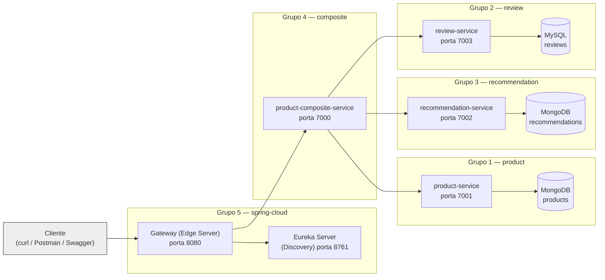
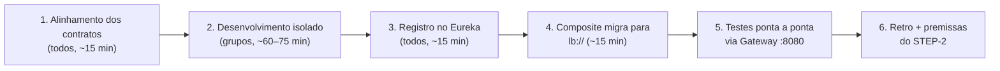

# Workshop: Microservices com Spring Boot 3 e Spring Cloud

> Laboratório de Desenvolvimento Multiplataforma — FATEC
> Atividade baseada no livro **"Microservices with Spring Boot 3 and Spring Cloud, 3rd Edition"** (Magnus Larsson, Packt), capítulos 3, 6, 9 e 10.
> Código-fonte de referência: capítulos `Chapter03`, `Chapter06`, `Chapter09` e `Chapter10` do repositório oficial do livro.

## Objetivos de aprendizagem

- Construir um conjunto de microservices cooperantes (3 serviços de núcleo + 1 serviço de composição).
- Aplicar persistência poliglota: MongoDB (documento) para product/recommendation e MySQL (relacional) para review.
- Implementar service discovery com Netflix Eureka e edge server com Spring Cloud Gateway.
- Definir e respeitar contratos de API entre equipes que desenvolvem em repositórios separados.
- (Step 2) Integrar os serviços em um monorepo com BFF, OpenFeign e Docker, escalando instâncias.

## O system landscape

Os 5 grupos construirão, isoladamente, partes deste cenário:

## Distribuição dos grupos

| Grupo | Repositório | Escopo | Porta | Dependências principais |
|-------|-------------|--------|-------|--------------------------|
| 1 | `product-service` | API de produtos + persistência MongoDB | 7001 | web, spring-data-mongodb |
| 2 | `review-service` | API de reviews + persistência MySQL (JPA) | 7003 | web, spring-data-jpa, driver MySQL |
| 3 | `recommendation-service` | API de recomendações + persistência MongoDB | 7002 | web, spring-data-mongodb |
| 4 | `product-composite-service` | Orquestra os 3 núcleos via RestTemplate | 7000 | web |
| 5 | `spring-cloud` | `eureka-server` (Discovery) + `gateway` (Edge Server) | 8761 / 8080 | netflix-eureka-server, spring-cloud-gateway |

## Convenções comuns (obrigatórias para todos)

- **Java 17**, **Spring Boot 3.x**, **Spring Cloud 2022.x**, **Gradle** (projetos gerados no [Spring Initializr](https://start.spring.io)).
- Pacotes raiz no padrão do livro: `se.magnus.api.*` (contratos) e `se.magnus.microservices.*` / `se.magnus.springcloud.*` (implementações). Manter os mesmos pacotes facilita o merge no monorepo do Step 2.
- Cada serviço de núcleo retorna o campo `serviceAddress` informando a instância que respondeu — resolvido com API moderna do Spring (ver STEP-1, seção "Endereço da instância").
- Erros seguem o contrato comum: `NotFoundException` → **HTTP 404**, `InvalidInputException` → **HTTP 422**, corpo no formato `HttpErrorInfo`.
- Persistência **local**: o banco (MongoDB/MySQL) pode rodar como o aluno preferir (instalação local, Docker, VM). Apenas a connection string entra no `application.yml`.

## Cronograma sugerido da aula

## Materiais

- [STEP-1.md](STEP-1.md) — instruções completas desta aula: contratos (DTOs, interfaces, entidades, exceções), tarefas por grupo, integração final e roteiro de testes.
- [STEP-2.md](STEP-2.md) — descrição parcial da próxima aula: monorepo, libs `api`/`util`, BFF com OpenFeign, Docker e escalonamento.

## Critérios de entrega (por grupo)

- Endpoints respondendo conforme o contrato do STEP-1 (códigos 404/422 inclusos).
- Serviço registrado no Eureka e acessível via Gateway ao final da aula.
- README do próprio repositório com instruções de execução (como subir o banco local e o serviço).
