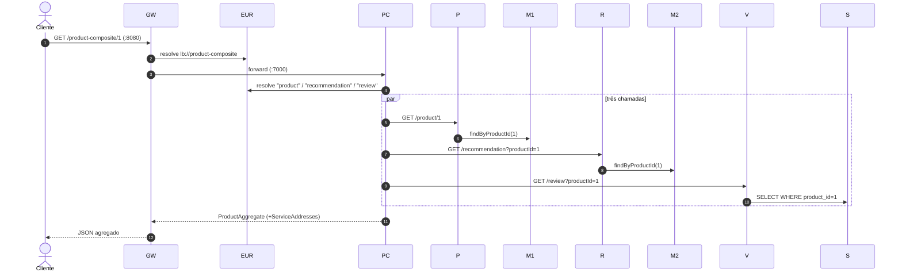

# STEP 1 — APIs básicas + Discovery (Eureka) + Edge Server (Gateway)

Instruções da atividade de hoje. Os grupos 1–4 implementam as APIs abaixo em repositórios separados; o grupo 5 implementa Discovery e Edge. Ao final, integramos tudo.

## 1. Contratos compartilhados

> Estes contratos são a "API unificada" que será extraída para a lib `api` no STEP-2. **Todos os grupos devem respeitar nomes, tipos e formatos exatamente como definidos aqui.**

### 1.1 DTOs (payloads JSON)

**Product**
```json
{ "productId": 1, "name": "string", "weight": 100, "serviceAddress": "host:port" }
```

**Recommendation**
```json
{ "productId": 1, "recommendationId": 1, "author": "string", "rate": 4, "content": "string", "serviceAddress": "host:port" }
```

**Review**
```json
{ "productId": 1, "reviewId": 1, "author": "string", "subject": "string", "content": "string", "serviceAddress": "host:port" }
```

**ProductAggregate** (resposta do composite)
```json
{
  "productId": 1,
  "name": "string",
  "weight": 100,
  "recommendations": [ { "recommendationId": 1, "author": "string", "rate": 4, "content": "string" } ],
  "reviews":       [ { "reviewId": 1, "author": "string", "subject": "string", "content": "string" } ],
  "serviceAddresses": { "cmp": "host:port", "pro": "host:port", "rev": "host:port", "rec": "host:port" }
}
```

- `RecommendationSummary` = `recommendationId, author, rate, content`
- `ReviewSummary` = `reviewId, author, subject, content`
- `ServiceAddresses` = `cmp` (composite), `pro` (product), `rev` (review), `rec` (recommendation)

### 1.2 Interfaces REST (assinaturas)

**ProductService** — `se.magnus.api.core.product`
| Método | Endpoint | Retorno |
|--------|----------|---------|
| `createProduct(Product)` | `POST /product` | `Product` |
| `getProduct(int productId)` | `GET /product/{productId}` | `Product` |
| `deleteProduct(int productId)` | `DELETE /product/{productId}` | `void` |

**RecommendationService** — `se.magnus.api.core.recommendation`
| Método | Endpoint | Retorno |
|--------|----------|---------|
| `createRecommendation(Recommendation)` | `POST /recommendation` | `Recommendation` |
| `getRecommendations(int productId)` | `GET /recommendation?productId=` | `List<Recommendation>` |
| `deleteRecommendations(int productId)` | `DELETE /recommendation?productId=` | `void` |

**ReviewService** — `se.magnus.api.core.review`
| Método | Endpoint | Retorno |
|--------|----------|---------|
| `createReview(Review)` | `POST /review` | `Review` |
| `getReviews(int productId)` | `GET /review?productId=` | `List<Review>` |
| `deleteReviews(int productId)` | `DELETE /review?productId=` | `void` |

**ProductCompositeService** — `se.magnus.api.composite.product`
| Método | Endpoint | Retorno |
|--------|----------|---------|
| `createProduct(ProductAggregate)` | `POST /product-composite` | `void` |
| `getProduct(int productId)` | `GET /product-composite/{productId}` | `ProductAggregate` |
| `deleteProduct(int productId)` | `DELETE /product-composite/{productId}` | `void` |

### 1.3 Entidades de persistência

**ProductEntity** (MongoDB — Grupo 1)
- `@Document(collection = "products")`
- `@Id String id`, `@Version Integer version`
- `@Indexed(unique = true) int productId`
- `String name`, `int weight`
- Repository: `extends MongoRepository<...>`, consulta por `findByProductId(int)`

**RecommendationEntity** (MongoDB — Grupo 3)
- `@Document(collection = "recommendations")`
- `@CompoundIndex(name = "prod-rec-id", unique = true, def = "{'productId': 1, 'recommendationId' : 1}")`
- `@Id String id`, `@Version Integer version`
- `int productId`, `int recommendationId`, `String author`, `int rating`, `String content`
  > Atenção: na entidade o campo chama-se `rating`; no DTO do contrato é `rate`. Faça o mapeamento correto entity↔DTO.

**ReviewEntity** (JPA/MySQL — Grupo 2)
- `@Entity @Table(name = "reviews", indexes = @Index(unique = true, columnList = "productId,reviewId"))`
- `@Id @GeneratedValue int id`, `@Version int version`
- `int productId`, `int reviewId`, `String author`, `String subject`, `String content`

### 1.4 Exceções e formato de erro

| Exceção | HTTP | Quando usar |
|---------|------|-------------|
| `NotFoundException` | 404 | GET de `productId` inexistente (product/composite) |
| `InvalidInputException` | 422 | `productId < 1` ou violação de regra de negócio (ex.: `rate` fora de 0–5) |

Corpo de erro (`HttpErrorInfo`):
```json
{ "timestamp": "...", "path": "/product/1", "status": 404, "error": "Not Found", "message": "No product found for productId: 1" }
```

### 1.5 Endereço da instância (`serviceAddress`)

Não use o `@Value("${server.port}")` do livro. Implementação de referência (`ServiceUtil`, disponível em `dev.sdras.utils.http` — será extraída para a lib `util` no STEP-2):

```java
@Component
public class ServiceUtil implements ApplicationListener<WebServerInitializedEvent> {
  // Boot 3: org.springframework.boot.web.context.WebServerInitializedEvent

  private Integer serverPort;
  private String serverIp;

  public Integer getServerPort() { return serverPort; }
  public String getServerIp() { return serverIp; }
  public String getServerAddress() { return "http://" + serverIp + ":" + serverPort; }

  @Override
  public void onApplicationEvent(WebServerInitializedEvent event) {
    this.serverPort = event.getWebServer().getPort();
    try {
      this.serverIp = InetAddress.getLocalHost().getHostAddress();
    } catch (UnknownHostException e) {
      this.serverIp = "unknown";
    }
  }
}
```

A porta real do web server é capturada via `WebServerInitializedEvent` — funciona até com `server.port: 0` (prepara para o escalonamento do STEP-2).

**Fase integrada (após o Eureka)** — alternativamente, injete `org.springframework.cloud.client.serviceregistry.Registration`:
```java
String address = registration.getHost() + ":" + registration.getPort();
```

**Desafio extra (composite)**: resolver `ServiceAddresses` via `DiscoveryClient.getInstances("product").get(0).getUri()` em vez de ler o campo do payload.

**Infra de banco** (Grupos 1–3): MongoDB/MySQL locais — livre escolha (instalado, Docker, etc.); apenas configure a connection string em `application.yml`.

## 2. Tarefas por grupo

### Grupo 1 — `product-service` (porta 7001)
- [ ] Endpoints `POST/GET/DELETE /product` conforme contrato 1.2.
- [ ] `ProductEntity` + repository MongoDB conforme 1.3.
- [ ] GET: `productId < 1` → 422; inexistente → 404. POST: `productId` duplicado → 422.
- [ ] Resposta com `serviceAddress` (ver 1.5).

### Grupo 2 — `review-service` (porta 7003)
- [ ] Endpoints `POST /review`, `GET/DELETE /review?productId=` conforme 1.2.
- [ ] `ReviewEntity` JPA + repository MySQL conforme 1.3.
- [ ] `productId < 1` → 422; GET de produto sem reviews retorna lista vazia (HTTP 200).
- [ ] Resposta com `serviceAddress`.

### Grupo 3 — `recommendation-service` (porta 7002)
- [ ] Endpoints `POST /recommendation`, `GET/DELETE /recommendation?productId=` conforme 1.2.
- [ ] `RecommendationEntity` MongoDB + repository conforme 1.3 (map `rating`↔`rate`).
- [ ] `productId < 1` → 422; GET sem recomendações retorna lista vazia (HTTP 200).
- [ ] Resposta com `serviceAddress`.

### Grupo 4 — `product-composite-service` (porta 7000)
- [ ] Bean `RestTemplate`; classe de integração implementando `ProductService`, `RecommendationService` e `ReviewService`.
- [ ] URLs configuráveis (fase isolada): `app.product-service.host/port`, `app.recommendation-service.host/port`, `app.review-service.host/port` — defaults `localhost:7001/7002/7003`.
- [ ] `createProduct`: cria product e, se presentes no payload, recommendations e reviews.
- [ ] `getProduct`: 3 GETs → monta `ProductAggregate` com `ServiceAddresses`; se product retornar 404, propaga 404.
- [ ] `deleteProduct`: deleta product + recommendations + reviews (tolerar 404 dos núcleos).
- [ ] Tratamento de `HttpClientErrorException`: extrair `HttpErrorInfo` do corpo e relançar como `NotFoundException`/`InvalidInputException`.
- [ ] **Na integração**: trocar para `http://product`, `http://recommendation`, `http://review` com `RestTemplate` `@LoadBalanced` (registrando no Eureka).

### Grupo 5 — `spring-cloud` (eureka-server + gateway)
- [ ] `eureka-server` (porta 8761): `@EnableEurekaServer`, `registerWithEureka: false`, `fetchRegistry: false`, dashboard em `http://localhost:8761`.
- [ ] `gateway` (porta 8080): dependência `spring-cloud-starter-gateway` + eureka-client.
- [ ] Rotas (via `spring.cloud.gateway.routes` no `application.yml`):
  - `/product-composite/**` → `lb://product-composite` (rota principal)
  - `/eureka/web`, `/eureka/api/**` → dashboard do Eureka via gateway (opcional)
- [ ] Health check: expor `/actuator/health` com `show-details: ALWAYS`.

## 3. Integração final (todos os grupos)

1. **Grupo 5**: subir o `eureka-server` primeiro.
2. **Grupos 1–4**: adicionar `spring-cloud-starter-netflix-eureka-client`, nomear a app (`spring.application.name: product`, `review`, `recommendation`, `product-composite`) e apontar `eureka.client.serviceUrl.defaultZone: http://localhost:8761/eureka/`.
3. **Grupo 4**: migrar o RestTemplate para `@LoadBalanced` + URIs `http://product` etc.
4. **Todos**: passar a resolver o `serviceAddress` via `Registration` (ver 1.5).
5. Validar no dashboard do Eureka (`http://localhost:8761`) as 5 instâncias **UP**.

## 4. Roteiro de testes (curl)

```bash
# 1) criar um produto composto (via composite, porta 7000)
curl -X POST localhost:7000/product-composite \
  -H "Content-Type: application/json" --data \
  '{"productId":1,"name":"produto 1","weight":100,
    "recommendations":[{"recommendationId":1,"author":"A","rate":4,"content":"ok"}],
    "reviews":[{"reviewId":1,"author":"B","subject":"s","content":"c"}]}'

# 2) consultar agregado
curl localhost:7000/product-composite/1

# 3) consultar um núcleo diretamente (ex.: reviews)
curl "localhost:7003/review?productId=1"

# 4) mesmo fluxo via Gateway (porta 8080) — após a integração
curl localhost:8080/product-composite/1 | jq

# 5) deletar e conferir cascata
curl -X DELETE localhost:8080/product-composite/1
```

## 5. Fluxo da chamada integrada (referência)



## 6. Critérios de aceite da aula

- `GET /product-composite/1` via `:8080` retorna o agregado com os 3 núcleos e `serviceAddresses` preenchidos.
- Dashboard do Eureka com 5 serviços registrados.
- Códigos 404/422 observados nos casos de erro do roteiro.
