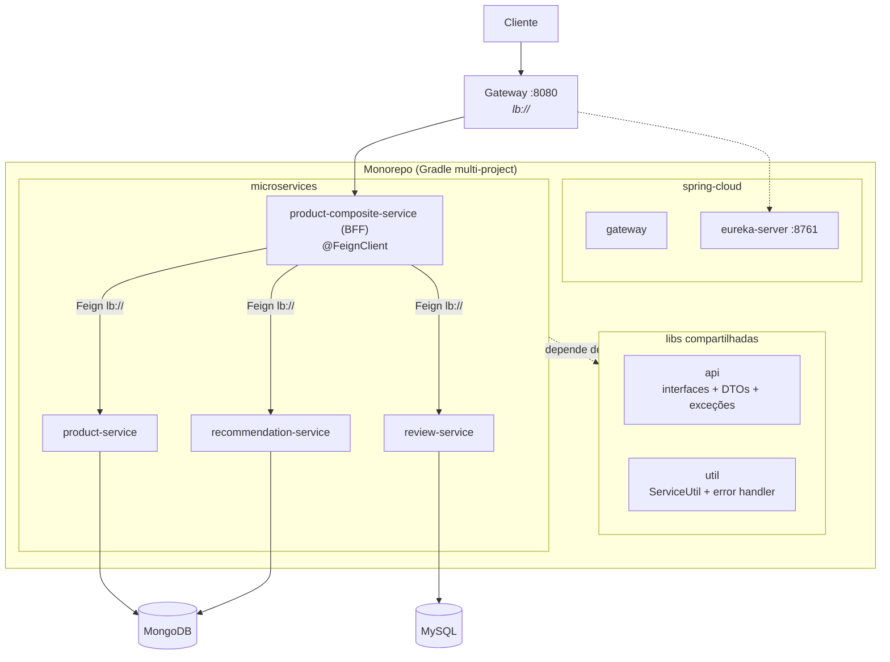
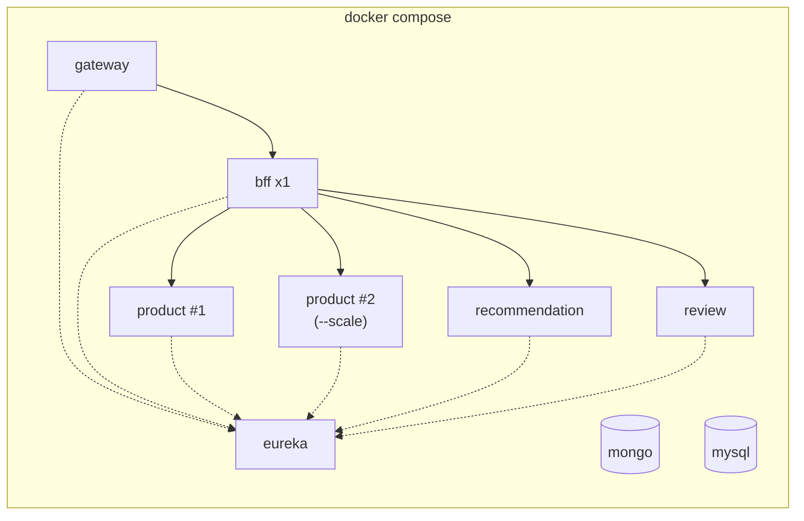

# STEP 2 — Monorepo + BFF com OpenFeign + Docker (premissa da próxima aula)

> ⚠️ **Fora do escopo da aula atual.** Este documento descreve, parcialmente, o que faremos na próxima aula: consolidar os 5 repositórios em um monorepo, **fechar o ciclo composite→núcleos** (BFF com OpenFeign), demonstrar o **balanceamento de carga** no ciclo completo e dockerizar o cenário com possibilidade de escala.

## 1. Monorepo (Gradle multi-project)

Os 5 repositórios do STEP-1 serão unidos:

```
workshop-microservices/
├── settings.gradle            # include 'api', 'util', microservices/*, spring-cloud/*
├── api/                       # lib: contratos (interfaces REST, DTOs, exceções)
├── util/                      # lib: utilitários compartilhados
├── microservices/
│   ├── product-service/
│   ├── recommendation-service/
│   ├── review-service/
│   └── product-composite-service/   # evolui para BFF
├── spring-cloud/
│   ├── eureka-server/
│   └── gateway/
└── docker-compose.yml
```

## 2. Libs compartilhadas

**`api`** — os contratos do STEP-1 (seções 1.1, 1.2 e 1.4) saem da duplicação entre repositórios e viram dependência única:
- Interfaces: `ProductService`, `RecommendationService`, `ReviewService`, `ProductCompositeService`
- DTOs: `Product`, `Recommendation`, `Review`, `ProductAggregate`, `RecommendationSummary`, `ReviewSummary`, `ServiceAddresses`
- Exceções: `NotFoundException`, `InvalidInputException`

**`util`** — código compartilhado (base: `dev.sdras.utils.http` do MicroservicesPlayground):
- `ServiceUtil`: resolve host/porta via `WebServerInitializedEvent` (standalone) ou `Registration` (com Eureka) — substitui o `@Value("${server.port}")` do livro com API moderna do Spring
- `HttpErrorInfo` + `GlobalControllerExceptionHandler` (`@ControllerAdvice` mapeando `NotFoundException`→404, `InvalidInputException`→422)

## 3. BFF + OpenFeign

O `product-composite-service` **sai do mock** do STEP-1 e evolui para um **BFF (Backend for Frontend)**: única porta de entrada de negócio para o frontend, orquestrando os núcleos.

A orquestração real é implementada com **Spring Cloud OpenFeign** (substituindo a classe mockada e o `RestTemplate` manual), aproveitando as interfaces da lib `api` como contrato do client:

```java
@FeignClient(name = "product")
public interface ProductClient extends ProductService { }
```

- `@EnableFeignClients` na aplicação do BFF
- Resolução via Eureka (`feign.client` + `spring-cloud-openfeign` no classpath)
- Regras do BFF permanecem as do STEP-1: cascata em create/delete, propagação de 404, propagação de 404/422 com base no `HttpErrorInfo` do núcleo

> **Nota de design — BFF ≠ lib de contratos.** O BFF é o `product-composite-service`: um **serviço em runtime** que orquestra os núcleos e molda a resposta para o frontend. A lib `api` é apenas a **biblioteca de contratos** (interfaces, DTOs, exceções) — sem runtime; é o *contrato* que os núcleos **implementam** e o BFF **consome**. A herança `ProductClient extends ProductService` é suportada oficialmente pelo Spring Cloud OpenFeign ("Feign Inheritance Support").

## 4. Docker + escalonamento + balanceamento de carga

- Um `Dockerfile` por serviço (base JRE 17).
- `docker-compose.yml` com o cenário completo: eureka, gateway, BFF, product, recommendation, review, MongoDB e MySQL.
- Profile `docker` em cada `application.yml` ajustando hostnames (ex.: `app.eureka-server: eureka`, hosts dos bancos).

**Balanceamento de carga (ciclo completo)** — com o BFF integrado, a escala + round-robin passam a valer para a orquestração inteira, do Gateway ao núcleo:

```bash
docker compose up -d --build
docker compose up -d --scale product=2 --scale review=2 --scale recommendation=2

# ciclo completo via Gateway — observe o round-robin no BFF e em cada núcleo
# (escale também o BFF com --scale product-composite=2 para o serviceAddresses.cmp alternar)
for i in $(seq 1 6); do
  curl -s localhost:8080/product-composite/1 | jq -r '.serviceAddresses.cmp, .serviceAddresses.pro'
done
```

> Dica: com múltiplas instâncias locais use `server.port: 0`; o `ServiceUtil` (via `WebServerInitializedEvent`) já resolve a porta real. (Referência: seção 1.5 do STEP-1.)

## 5. Arquitetura alvo do STEP-2





## 6. O que vem depois (alinhamento com a disciplina)

A disciplina é focada em **Microservices com Message Broker** — os próximos passos naturais (capítulos do livro):

1. **Spring Cloud Stream + Kafka/RabbitMQ**: `createProduct`/`deleteProduct` passam a publicar **eventos**; os núcleos consomem de tópicos de forma assíncrona (comunicação event-driven, complementar ao GET síncrono).
2. **Resilience4j**: circuit breaker, retry e fallback no BFF.
3. **Observabilidade**: distributed tracing (Micrometer Tracing) e métricas.

## 7. Pré-requisitos para a próxima aula

- STEP-1 versionado nos 5 repositórios (tags por grupo facilitam o merge).
- Docker rodando na máquina (Docker Engine + Compose plugin).
- Contratos do STEP-1 estáveis — qualquer divergência de DTO/endpoint deve ser corrigida **antes** do merge no monorepo.
- Aceite do STEP-1 concluído por grupo (núcleos entregues com endpoints reais; o mock do composite é substituído na própria aula 2).
- Rota de debug removida/desativada após a validação (núcleos ficam internos, acessíveis só pelo BFF via Eureka).
