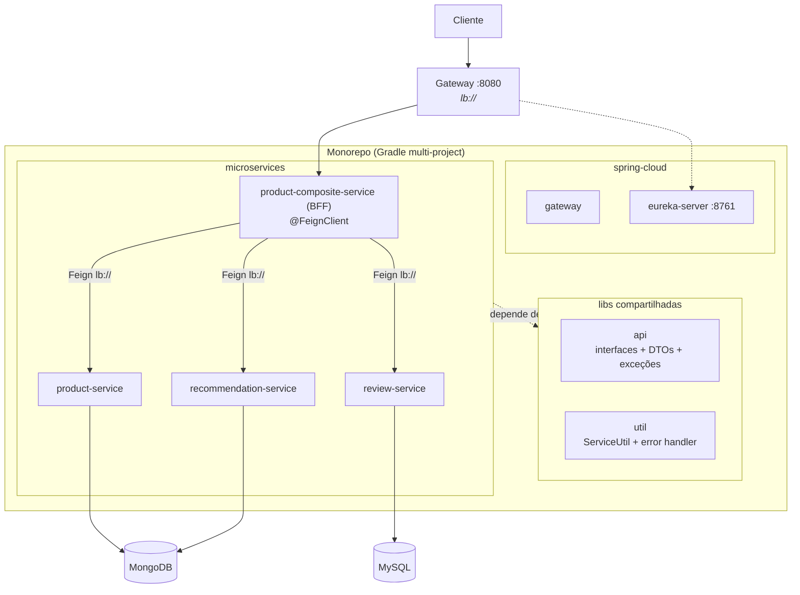
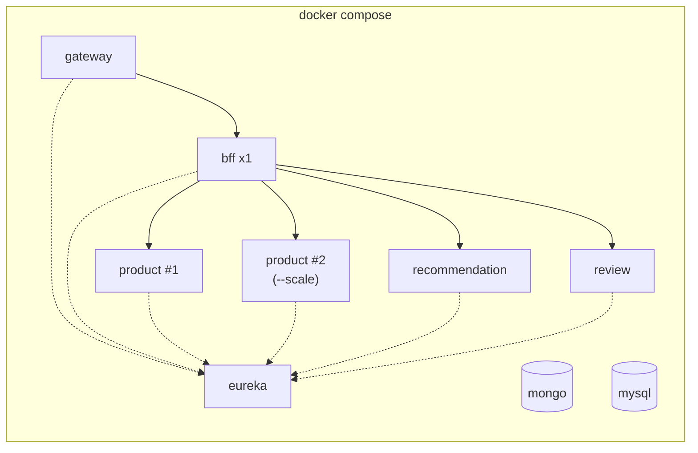

# STEP 2 — Integração dos serviços + Docker + balanceamento de carga

> **Comece pelos roteiros do repositório:** [STEP-2-LIBS](STEP-2-LIBS.md) explica `util` e `api`; [STEP-3-COMPOSITE](STEP-3-COMPOSITE.md) implementa o BFF. Eureka/Gateway e os três núcleos ainda devem ser incorporados pelas equipes.

Este documento apresenta as etapas posteriores: incorporar os três serviços de núcleo e os projetos Eureka/Gateway, demonstrar o **balanceamento de carga** e dockerizar o cenário com possibilidade de escala. O composite com OpenFeign já está implementado conforme STEP-3.

## 1. Monorepo (Gradle multi-project)

Após a preparação das libs e a incorporação dos projetos pelas equipes, os cinco repositórios do STEP-1 formarão a estrutura abaixo. O `docker-compose.yml` será criado na etapa de Docker:

```
workshop-microservices/
├── settings.gradle            # include explícito de 'api', 'util' e de cada serviço quando presente
├── api/                       # lib: contratos (interfaces REST, DTOs, exceções)
├── util/                      # lib: utilitários compartilhados
├── microservices/
│   ├── product-service/
│   ├── recommendation-service/
│   ├── review-service/
│   └── product-composite-service/   # BFF com OpenFeign
├── spring-cloud/
│   ├── eureka-server/
│   └── gateway/
└── docker-compose.yml
```

## 2. Libs compartilhadas

A implementação completa está no [STEP-2-LIBS](STEP-2-LIBS.md), na ordem `util` → `api`. O resumo abaixo descreve o papel de cada biblioteca.

**`api`** — os contratos do STEP-1 (seções 1.1, 1.2 e 1.4) saem da duplicação entre repositórios e viram dependência única:
- Interfaces: `ProductService`, `RecommendationService`, `ReviewService`, `ProductCompositeService`
- DTOs: `Product`, `Recommendation`, `Review`, `ProductAggregate`, `RecommendationSummary`, `ReviewSummary`, `ServiceAddresses`
- Exceções: `NotFoundException`, `InvalidInputException`

**`util`** — código compartilhado, extraído do `ServiceUtil` do STEP-1, agora em `br.com.fatecararas.util.http`:
- `ServiceUtil`: captura a porta efetiva do servidor via `WebServerInitializedEvent` e o IP com `InetAddress`, ignorando eventos de contexto filho. Não usa Eureka nem `Registration`; a resolução de host/porta via `Registration` da seção 1.5 do STEP-1 permanece uma alternativa do próprio serviço, não da lib.
- `HttpErrorInfo` + `GlobalControllerExceptionHandler` (`@RestControllerAdvice` MVC mapeando `NotFoundException`→404, `InvalidInputException`→422 e erros de leitura da requisição→400)
- `OpenApiConfiguration`: metadados por aplicação e schema compartilhado de erro. Interfaces e DTOs em `api` recebem as anotações Swagger; o starter de UI entra nos serviços MVC.

As entidades MongoDB/JPA e os repositories permanecem nos respectivos serviços. A dependência é `util` → `api`, sem ciclo; o Gateway reativo não recebe a lib `util` MVC.

## 3. BFF + OpenFeign

O `product-composite-service` **sai do mock** do STEP-1 e evolui para um **BFF (Backend for Frontend)**: única porta de entrada de negócio para o frontend, orquestrando os núcleos.

A orquestração real é implementada com **Spring Cloud OpenFeign** (substituindo a classe mockada e o `RestTemplate` manual), aproveitando as interfaces da lib `api` como contrato do client:

```java
@FeignClient(name = "${app.services.product}")
public interface ProductClient extends ProductService { }
```

- `@EnableFeignClients` na aplicação do BFF; os IDs dos serviços são configurados em `app.services` no `application.yml`
- Resolução via Eureka e Spring Cloud LoadBalancer; os IDs lógicos são `app.services.product`, `app.services.recommendation` e `app.services.review`
- Regras do BFF: cascata em create/delete e tradução dos status remotos 400/404/422 para as exceções compartilhadas; consulte o STEP-3 para os detalhes atuais

> **Nota de design — BFF ≠ lib de contratos.** O BFF é o `product-composite-service`: um **serviço em runtime** que orquestra os núcleos e molda a resposta para o frontend. A lib `api` é apenas a **biblioteca de contratos** (interfaces, DTOs, exceções) — sem runtime; é o *contrato* que os núcleos **implementam** e o BFF **consome**. A herança `ProductClient extends ProductService` é suportada oficialmente pelo Spring Cloud OpenFeign ("Feign Inheritance Support").

## 4. Docker + escalonamento + balanceamento de carga

- Um `Dockerfile` por serviço (base JRE 17).
- `docker-compose.yml` com o cenário completo: eureka, gateway, BFF, product, recommendation, review, MongoDB e MySQL.
- Profile `docker` em cada `application.yml` ajustando hostnames (ex.: `app.eureka-server: eureka`, hosts dos bancos).

**Balanceamento de carga (ciclo completo)** — com o BFF integrado, a escala + round-robin passam a valer para a orquestração inteira, do Gateway ao núcleo:

```bash
docker compose up -d --build
docker compose up -d --scale product=2 --scale review=2 --scale recommendation=2

# ciclo completo via Gateway — observe o round-robin no BFF e em cada núcleo
# (escale também o BFF com --scale product-composite=2 para o serviceAddresses.cmp alternar)
for i in $(seq 1 6); do
  curl -s localhost:8080/product-composite/1 | jq -r '.serviceAddresses.cmp, .serviceAddresses.pro'
done
```

> Dica: com múltiplas instâncias locais use `server.port: 0`; o `ServiceUtil` (via `WebServerInitializedEvent`) já resolve a porta real. (Referência: seção 1.5 do STEP-1.)

## 5. Arquitetura alvo do STEP-2





## 6. O que vem depois (alinhamento com a disciplina)

A disciplina é focada em **Microservices com Message Broker** — os próximos passos previstos para o workshop são:

1. **Spring Cloud Stream + Kafka/RabbitMQ**: `createProduct`/`deleteProduct` passam a publicar **eventos**; os núcleos consomem de tópicos de forma assíncrona (comunicação event-driven, complementar ao GET síncrono).
2. **Resilience4j**: circuit breaker, retry e fallback no BFF.
3. **Observabilidade**: distributed tracing (Micrometer Tracing) e métricas.

## 7. Pré-requisitos para a próxima aula

- STEP-1 versionado nos 5 repositórios (tags por grupo facilitam o merge).
- Docker rodando na máquina (Docker Engine + Compose plugin).
- Contratos do STEP-1 estáveis — qualquer divergência de DTO/endpoint deve ser corrigida **antes** do merge no monorepo.
- Aceite do STEP-1 concluído por grupo (núcleos entregues com endpoints reais e integrados ao BFF do STEP-3).
- Rota de debug removida/desativada após a validação (núcleos ficam internos, acessíveis só pelo BFF via Eureka).
