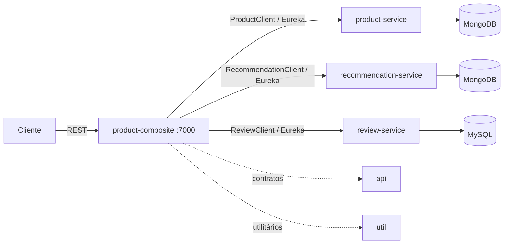
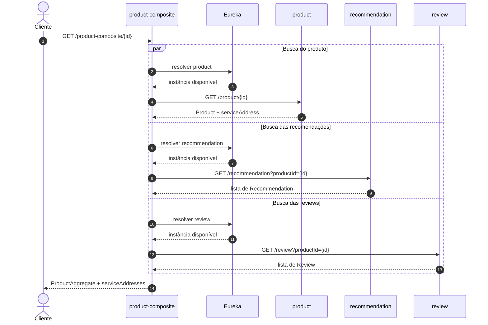

# STEP 3 — Product Composite com OpenFeign e Swagger

> Este roteiro parte da base com `api` e `util` implementadas. Ele implementa somente o `product-composite-service`; os núcleos (`product`, `review` e `recommendation`), Eureka e Gateway precisam ser incorporados pelos respectivos grupos conforme STEP-1/STEP-2.

## Objetivos e responsabilidades

O composite é um BFF: recebe a chamada do cliente, conversa com os três serviços proprietários e devolve um `ProductAggregate`. DTOs, interfaces REST e exceções continuam sendo os contratos compartilhados da biblioteca `api`. O composite não contém entidades nem acesso aos bancos dos núcleos.



No GET, as três leituras são independentes e executadas em paralelo. O resultado agregado mantém listas vazias como `[]`; os endereços vêm dos itens retornados e, quando não há itens, do registro Eureka.



## 1. Pré-requisitos e inclusão Gradle

Use JDK 17 e o Wrapper da raiz. O projeto foi incluído em `settings.gradle` como `microservices:product-composite-service`. As dependências de `api` e `util` são project dependencies, então não publique JARs em Maven.

Dependências esperadas no módulo:

```groovy
implementation project(':api')
implementation project(':util')
implementation 'org.springframework.boot:spring-boot-starter-web'
implementation 'org.springframework.cloud:spring-cloud-starter-openfeign'
implementation 'org.springframework.cloud:spring-cloud-starter-netflix-eureka-client'
implementation "org.springdoc:springdoc-openapi-starter-webmvc-ui:${rootProject.springdocVersion}"
```

O build raiz centraliza Spring Boot 3.0.4 e o BOM Spring Cloud 2022.0.2. Não adicione `spring-boot-starter-webflux`: os quatro serviços de negócio são MVC.

## 2. Organização do código

```text
microservices/product-composite-service/
├── build.gradle
└── src/main/
    ├── java/br/com/fatecararas/composite/
    │   ├── ProductCompositeApplication.java
    │   ├── client/                 # Feign clients e tradução de erros remotos
    │   ├── service/                # integração e montagem do agregado
    │   └── web/                    # controller que implementa o contrato api
    └── resources/application.yml
```

`ProductCompositeApplication` ativa Feign e importa `ServiceUtil`, `GlobalControllerExceptionHandler` e `OpenApiConfiguration` da lib `util`. O controller implementa `ProductCompositeService`, herdando mappings e documentação OpenAPI; não repita as anotações de rota.

## 3. Clientes Feign e descoberta

Crie três interfaces Feign que estendem, cada uma, o contrato da lib:

```java
@FeignClient(name = "${app.services.product}")
public interface ProductClient extends ProductService { }
```

Repita para `RecommendationService` (`${app.services.recommendation}`) e `ReviewService` (`${app.services.review}`). Os valores vêm de `app.services` em `application.yml` e precisam ser iguais ao `spring.application.name` registrado por cada núcleo. A classe `ServiceIds` mapeia essas propriedades, ativada por `@EnableConfigurationProperties` na aplicação. Eureka/LoadBalancer escolhem a instância; não fixe host ou porta nos clients.

O contrato de criação é uma cascata: criar produto, depois recomendações e reviews recebidos. Na exclusão, apagar o produto e os dados associados nos dois núcleos. Isso não é uma transação distribuída: uma falha após uma etapa pode deixar escrita parcial. Neste exercício, propague o erro e registre contexto suficiente para diagnóstico; compensação, outbox e idempotência são extensões posteriores.

O GET consulta os três clients em paralelo, usando o executor gerenciado pelo Spring. A implementação mapeia `Recommendation` para `RecommendationSummary` e `Review` para `ReviewSummary`; não inclua `productId` repetido nem `serviceAddress` dos itens nos resumos. `serviceAddresses` usa o endereço retornado nos itens quando há resultado e, para listas vazias, consulta uma instância registrada no Eureka.

## 4. Tratamento de erros entre serviços

O handler de `util` converte `NotFoundException` em 404, `InvalidInputException` em 422 e entradas inválidas em 400, sempre com `HttpErrorInfo`. Configure um `ErrorDecoder` para converter respostas remotas 404 em `NotFoundException`, e 400/422 em `InvalidInputException`. Respostas de infraestrutura (5xx, timeout, indisponibilidade) devem continuar erros de servidor, não ser reclassificadas como erro do cliente.

Valide `productId >= 1` no composite antes de chamar os núcleos. No GET, 404 do product-service encerra a consulta com 404. Listas vazias de recommendation/review são sucesso e aparecem como arrays vazios. O `join` de futures deve desembrulhar `CompletionException` e relançar sua causa de runtime; assim o handler compartilhado mantém os status definidos pelo serviço remoto.

POST e DELETE retornam 202 sem corpo conforme o contrato. O 202 descreve aceitação da operação síncrona de cascata nesta etapa; não significa que já exista mensageria ou processamento assíncrono.

## 5. Configuração e execução

Configuração mínima (`src/main/resources/application.yml`):

```yaml
server:
  port: 7000
spring:
  application:
    name: product-composite
  cloud:
    openfeign:
      circuitbreaker:
        enabled: false
app:
  services:
    product: ${PRODUCT_SERVICE_ID:product}
    recommendation: ${RECOMMENDATION_SERVICE_ID:recommendation}
    review: ${REVIEW_SERVICE_ID:review}
eureka:
  client:
    service-url:
      defaultZone: ${EUREKA_URL:http://localhost:8761/eureka/}
springdoc:
  api-docs:
    path: /v3/api-docs
  swagger-ui:
    path: /swagger-ui.html
  override-with-generic-response: false
```

Para exercitar as chamadas agregadas, inicie Eureka e os três núcleos e confirme no dashboard que `PRODUCT`, `RECOMMENDATION` e `REVIEW` estão `UP`. Esses quatro módulos ainda não fazem parte deste repositório; eles precisam ser importados pelas equipes. Para consultar somente Swagger/OpenAPI, o composite pode ser iniciado sem os backends:

```bash
./gradlew :microservices:product-composite-service:bootRun
```

`app.services` define os IDs registrados no Eureka pelos três serviços de núcleo. Os Feign clients e a consulta de endereços usam os mesmos valores; não fixe hosts ou portas porque o Eureka/LoadBalancer seleciona as instâncias. Isso corresponde ao Capítulo 11 do [repositório de referência](https://github.com/PacktPublishing/Microservices-with-Spring-Boot-and-Spring-Cloud-Fourth-Edition/tree/main/Chapter11), que usa destinos lógicos `http://product`, `http://recommendation` e `http://review` com um cliente load-balanced. Sem Eureka/serviços registrados, a aplicação inicia mas as chamadas agregadas falham. A porta padrão atual é `7000`; se estiver ocupada, inicie com `SERVER_PORT=7100 ./gradlew :microservices:product-composite-service:bootRun` e substitua a porta nas URLs abaixo.

## 6. Swagger / OpenAPI

O starter WebMVC UI pertence à aplicação executável, não às libs. A configuração comum informa o título com `spring.application.name` e registra o schema `HttpErrorInfo`; a interface `ProductCompositeService` fornece operações, status e schemas de request/response.

Ao documentar uma operação, escreva uma descrição que explique o fluxo e efeitos observáveis. Por exemplo, o GET agrega três consultas paralelas, pode retornar listas vazias e propaga 404 quando o produto não existe. No POST, descreva a cascata e informe que ela não é transacional. No DELETE, explique a idempotência definida pelos serviços de núcleo. Evite descrições vagas como “Operação concluída”.

Inclua exemplos JSON no request do POST e na resposta 200 do GET. Os exemplos devem usar os mesmos nomes e tipos definidos pelos DTOs. Declare explicitamente 202 sem corpo para POST/DELETE, 200 com `ProductAggregate` para GET e os erros 400/404/422 com o schema compartilhado `HttpErrorInfo`.

Anote os campos dos DTOs agregados com significado, exemplos e limites previstos no contrato. Documente `recommendations` e `reviews` como listas que podem estar vazias; marque `serviceAddresses` como somente leitura e explique as chaves `cmp`, `pro`, `rev` e `rec`. Esse detalhamento permite entender o payload sem consultar o código-fonte.

- Swagger UI: `http://localhost:7000/swagger-ui.html`
- OpenAPI JSON: `http://localhost:7000/v3/api-docs`

Confirme que aparecem `POST /product-composite` (202 sem corpo), `GET /product-composite/{productId}` (200 com exemplo de agregado e erros 400/404/422) e `DELETE /product-composite/{productId}` (202 sem corpo). As respostas de erro devem referenciar `HttpErrorInfo`, com `timestamp`, `path`, `status`, `error` e `message`. Confira também exemplos e descrições dos campos no schema `ProductAggregate`. A UI direta no serviço é o escopo desta etapa; o Gateway ainda não agrega os documentos.

## 7. Contrato e chamadas de exemplo

```bash
curl -i http://localhost:7000/product-composite/1
curl -i http://localhost:7000/product-composite/0
curl -i http://localhost:7000/product-composite/99999
```

POST:

```bash
curl -i -X POST http://localhost:7000/product-composite \
  -H 'Content-Type: application/json' \
  -d '{"productId":1,"name":"produto 1","weight":100,"recommendations":[{"recommendationId":1,"author":"Ana","rate":5,"content":"ótimo"}],"reviews":[{"reviewId":1,"author":"Bia","subject":"bom","content":"recomendo"}]}'
```

DELETE:

```bash
curl -i -X DELETE http://localhost:7000/product-composite/1
```

Esperado: GET existente retorna `ProductAggregate`; id inválido retorna 422; produto inexistente retorna 404; POST/DELETE retornam 202 sem payload. `serviceAddresses.cmp` deve refletir a instância atual; `pro`, `rev` e `rec` vêm dos serviços correspondentes.

## 8. Critérios de conclusão

- [ ] Aplicação sobe na porta 7000 (ou porta alternativa configurada) e registra `product-composite` no Eureka.
- [ ] Controller implementa a interface da lib `api` sem duplicar mappings.
- [ ] Feign descobre os três serviços pelos nomes registrados.
- [ ] GET agrega consultas paralelas, listas vazias e endereços das instâncias.
- [ ] POST/DELETE executam a cascata e respondem 202; falhas remotas mantêm o status de negócio.
- [ ] Swagger UI/OpenAPI exibem os três endpoints, DTOs e erros.
- [ ] Chamadas parciais em POST/DELETE são compreendidas como limite da ausência de transação distribuída.
